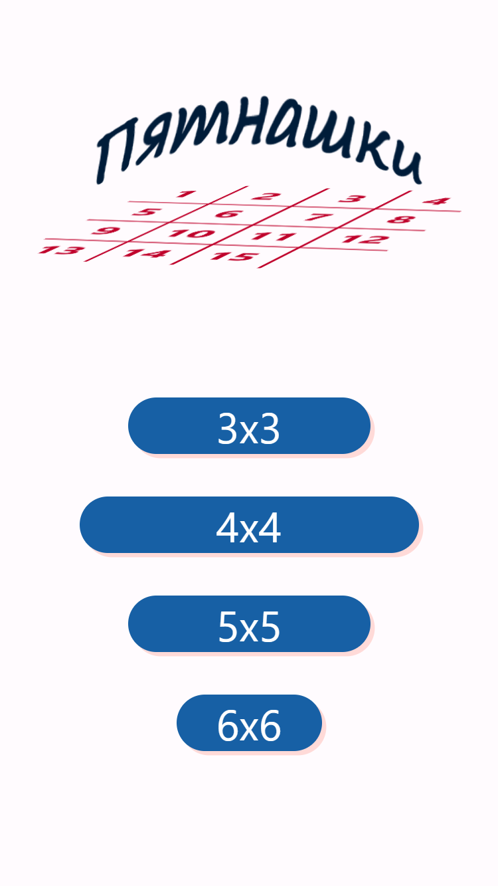
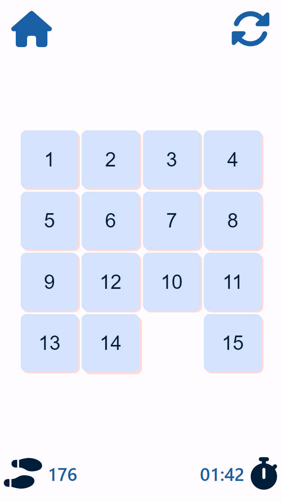
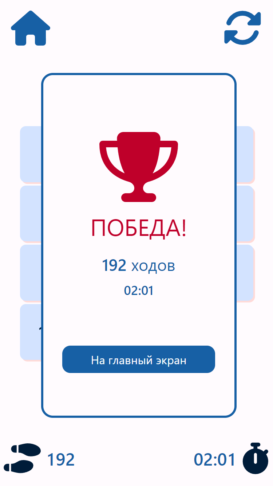

# Пятнашки - простая головоломка

 Пятнашки — это головоломка, где нужно перемещать плитки по полю 4x4, чтобы упорядочить числа от 1 до 15, оставив одну ячейку пустой для перемещения.

<p align="center">
    
    
    
</p>

 ## Попробовать
[WEB](https://wracce.github.io/pytnawko)

## Возможности

⚡ Выбор размера поля 

⚡ Множественное перемещение

## Стек технологий

 * Vite, Yarn
 * TypeScript, Less
 * React, Airbnb style
 * Fortawesome
 * React-router-dom, use-sound, react-transition-group
 * Eslint, Prettier
 * FSD, BEM, SOLID

## Сборка / Запуск


1. Установка зависимостей

```bash
npm install
```

2. Запуск проекта

```bash
npm run dev
# или используйте yarn
yarn dev
```

3. Сборка проекта

```bash
npm run build
# или используйте yarn
yarn build
```


## Лицензия
MIT license